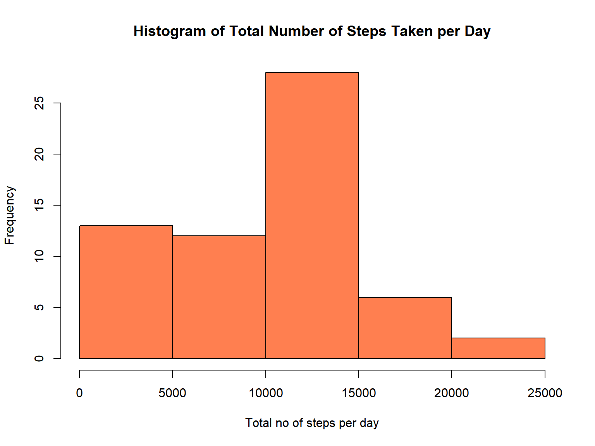
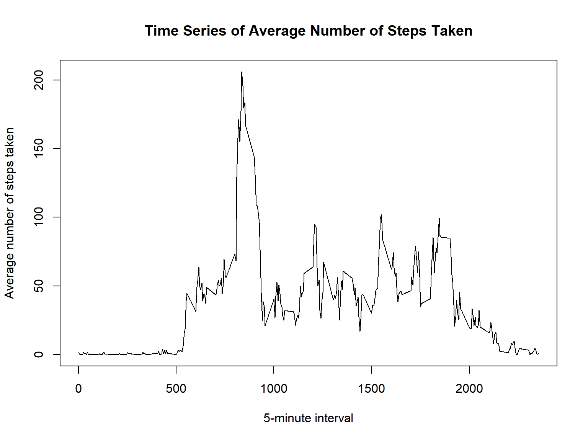
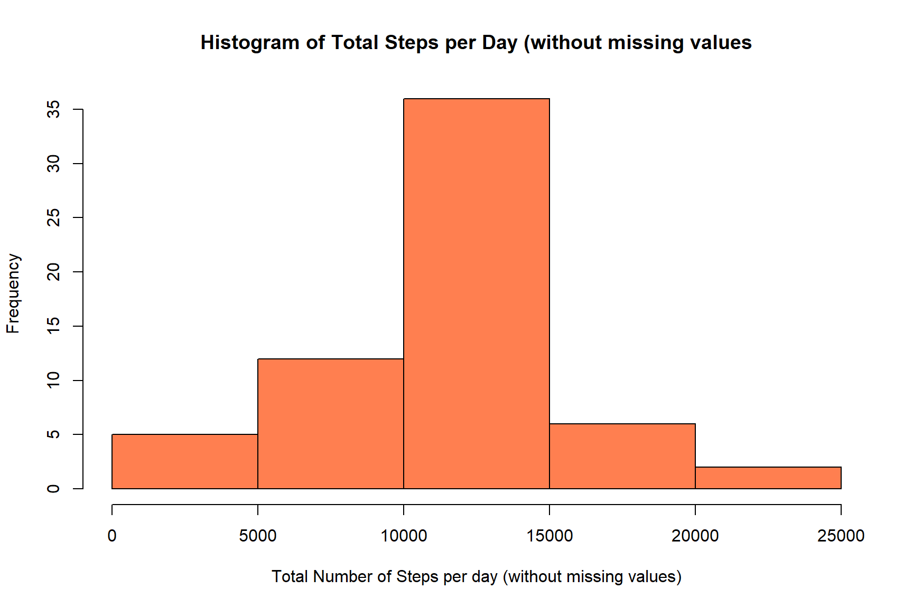
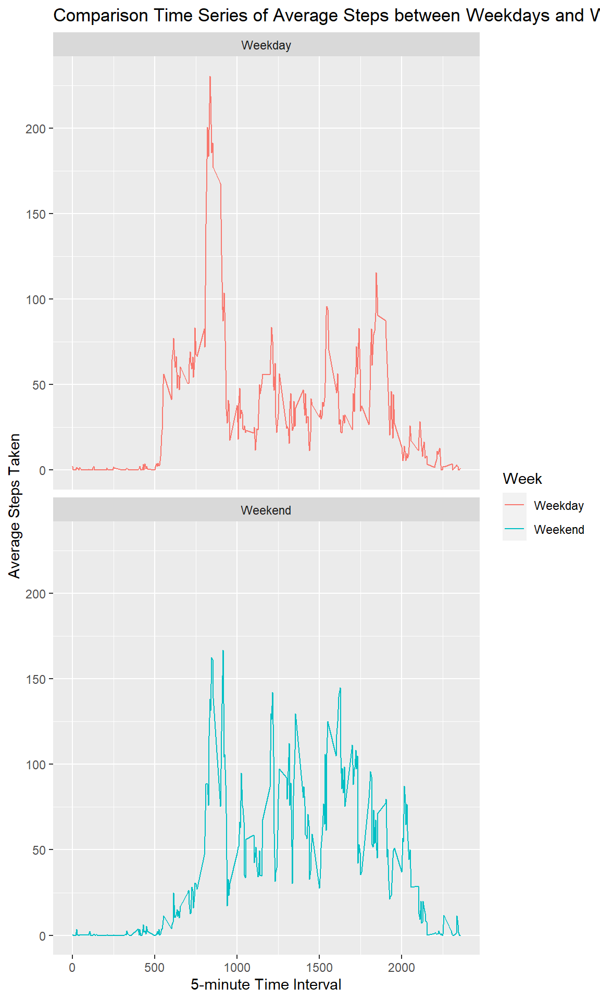

## R Markdown

First, need to load the data set containing the activity monitoring data

```r
link <- "https://d396qusza40orc.cloudfront.net/repdata%2Fdata%2Factivity.zip"
download.file(link, destfile = "activitymonitoring.zip")
unzip("activitymonitoring.zip")
AM_data <- read.csv("./activity.csv")

##To check the data
head(AM_data)
```

```
##   steps       date interval
## 1    NA 2012-10-01        0
## 2    NA 2012-10-01        5
## 3    NA 2012-10-01       10
## 4    NA 2012-10-01       15
## 5    NA 2012-10-01       20
## 6    NA 2012-10-01       25
```

### Total Number of Steps taken per day.


```r
library(dplyr)
```

```
## 
## Attaching package: 'dplyr'
```

```
## The following objects are masked from 'package:stats':
## 
##     filter, lag
```

```
## The following objects are masked from 'package:base':
## 
##     intersect, setdiff, setequal, union
```


```r
daily_tot <- AM_data %>%
  group_by(date) %>%
  summarize(tot_steps = sum(steps, na.rm = TRUE))
```
**Make a histogram of the total number of steps taken each day**

```r
hist(daily_tot$tot_steps, 
     xlab = "Total no of steps per day", ylab = "Frequency", main = "Histogram of Total Number of Steps Taken per Day", col = "coral")
```



**To calculate the mean and median of the total number of steps taken per day**


```r
tot_mean <- mean(daily_tot$tot_steps)
tot_median <- median(daily_tot$tot_steps)
```
The average of the total number of steps taken per day is **9354.2295082** while the median value is **10395!**

### Average daily activity pattern
1. Make a time series plot (i.e type = "l"|}type = "l") of the 5-minute interval (x-axis) and the average number of steps taken, averaged across all days (y-axis)

```r
##First, group the activity data set by the interval, then calculate the mean of the groups while ignoring the NAs
interval_mean <- AM_data %>%
  group_by(interval) %>%
  summarize(step_avg = mean(steps, na.rm = TRUE))

##Make time series plot
plot(interval_mean$interval, interval_mean$step_avg, type = "l", 
     xlab = "5-minute interval", ylab = "Average number of steps taken",
     main = "Time Series of Average Number of Steps Taken")
```



**Which 5-minute interval, on average across all the days in the dataset, contains the maximum number of steps?**

```r
interval_mean$interval[which.max(interval_mean$step_avg)]
```

```
## [1] 835
```

### Imputing missing values
Sometimes, having missing values in a data set can throw all the analysis off. This is because there might be different variables that might have caused the NAs. One has to make a decision on how to deal with the missing values. In this case, all missing values will be replaced with the daily means and the total mean will be compared to the value previously reported.


```r
##First, count the total number of missing values
tot_missing <- sum(is.na(AM_data$steps))
```
The total number of missing values (i.e rows with NA) is **2304**  
Now, devise a strategy for filling in all of the missing values in the data set. Plan to replace the missing values with the mean of the daily 5-minute time interval.  
Create a new data set where all the missing values are replaced with the mean of the daily 5-minute time interval.


```r
##make a copy of the original activity data set
up_AM_data <- AM_data

##Make a loop to replace every NA with the mean of the daily 5-minute time interval
for (i in interval_mean$interval) {
  up_AM_data[up_AM_data$interval == i & 
    is.na(up_AM_data$steps), ]$steps <- interval_mean$step_avg[
      interval_mean$interval == i 
    ]
}
head(up_AM_data)
```

```
##       steps       date interval
## 1 1.7169811 2012-10-01        0
## 2 0.3396226 2012-10-01        5
## 3 0.1320755 2012-10-01       10
## 4 0.1509434 2012-10-01       15
## 5 0.0754717 2012-10-01       20
## 6 2.0943396 2012-10-01       25
```

```r
##Check if there is any missing value left
sum(is.na(up_AM_data))
```

```
## [1] 0
```
Make a histogram of the total number of steps taken each day and Calculate and report the mean and median total number of steps taken per day. Do these values differ from the estimates from the first part of the assignment? What is the impact of imputing missing data on the estimates of the total daily number of steps?  


```r
##calculate the daily total steps
up_daily_tot <- up_AM_data %>%
  group_by(date) %>%
  summarize(up_tot_steps = sum(steps))

##Create an histogram of the new dataset
hist(up_daily_tot$up_tot_steps, xlab = "Total Number of Steps per day (without missing values)", ylab = "Frequency", main = "Histogram of Total Steps per Day (without missing values", col = "coral")
```



```r
##Calculate the mean and median of the total steps taken
mean_upData <- mean(up_daily_tot$up_tot_steps)
med_upData <- median(up_daily_tot$up_tot_steps)
```
The mean of the new data set(with all missing values replaced with the mean of the daily 5-minute time interval) is 1.0766189\times 10^{4} while the median is 1.0766189\times 10^{4}.  
In comparison to the mean **(9354.2295082)** and the median **(10395)** calculated for the data set where the missing values were ignored, the mean and median of the data set with missing values imputed are significantly higher, especially for the mean. The newly calculated mean and median are the same. This is because the missing values were replaced with the mean of of the daily 5-minute interval. With this replacement, many daily step values are the same. 

## Difference in activity patterns between weekdays and weekends
Will use the new data set with the imputed missing values.

```r
##Create a new factor variable in the dataset with two levels – “weekday” and “weekend” indicating whether a given date is a weekday or weekend day.
up_AM_data$Day <- weekdays(as.Date(up_AM_data$date))

##Indicate "weekday" or "weekend"
up_AM_data$Week <- ""
up_AM_data[up_AM_data$Day == "Saturday" | up_AM_data$Day == 
             "Sunday", ]$Week <- "Weekend"
up_AM_data[!(up_AM_data$Day == "Saturday" | up_AM_data$Day == 
             "Sunday"), ]$Week <- "Weekday"
```
Make a panel plot containing a time series plot (i.e. type = "l") of the 5-minute interval (x-axis) and the average number of steps taken, averaged across all weekday days or weekend days (y-axis)


```r
##Will use lattice
library(lattice)
```

```
## Warning: package 'lattice' was built under R version 4.1.3
```

```r
library(ggplot2)
```

```
## Warning: package 'ggplot2' was built under R version 4.1.3
```


```r
##First, group the data by 5-minute interval and take the average
up_int_mean <- up_AM_data %>%
  group_by(interval, Week) %>%
  summarize(avg_step = mean(steps))
```

```
## `summarise()` has grouped output by 'interval'. You can override using the `.groups` argument.
```

```r
ggplot(up_int_mean, aes(interval, avg_step, color=Week)) +
  geom_line() +
  facet_wrap(~Week, nrow = 2) +
  labs(x = "5-minute Time Interval", y = "Average Steps Taken") +
  ggtitle("Comparison Time Series of Average Steps between Weekdays and Weekends")
```



From the panel plot above, the average steps taken between the first 1000 minute is significantly in weekdays compared to weekends. Apart from this, the weekend has higher average steps taken per 5-minute time interval compared to the weekday. 
